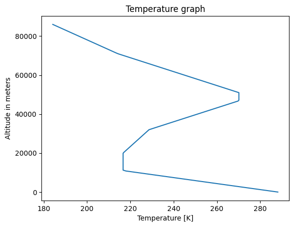
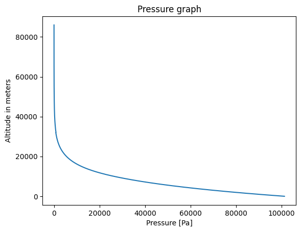

Atmosphere module
=================

This module defines several atmosphere models to compute density, pressure, temperature and other useful quantities at the altitude of interest for the other modules. Here is the list of the atmosphere models implemented:

* Constant atmosphere
* Linear atmosphere
* Standard atmosphere

Constant atmosphere
-------------------

This is a debug atmosphere model. The density is considered constant equal to the sea level at any altitude.

Linear atmosphere
-----------------

This is a simple atmospheric model that is mostly used to compute air density. The atmospheric model used is a simplification of the standard atmosphere and it is valid between 0 and 11km of altitude.

Physical background
^^^^^^^^^^^^^^^^^^^

The model is based here on a single formula:

.. math:: \sigma = \frac{20-z}{20+z}
   :label: sigma-formula

with:

.. math:: \sigma = \frac{\rho}{\rho_0}
    :label: sigma-def

Examples
^^^^^^^^

The functions allow to compute the density:

>>> compute_sigma_from_altitude(4.2e3)
0.6528925619834711

or directly the mass per cubic meter:

>>> compute_density_from_altitude(3e3)
0.9054347826086957

For a given sigma, it is also possible to compute the altitude:

>>> compute_altitude_from_sigma(0.7891)
2357.609971494047

Standard atmosphere
-------------------

This is the International Standard Atmosphere model and it allows to compute the following quantities:

* temperature
* pressure
* density
* sound speed
* dynamic viscosity
* kinematic viscosity

Physical background
^^^^^^^^^^^^^^^^^^^

Here is the list of hypotheses of the model:

1. The air is considered to be a perfect gas with :math:`r = 287 J.kg^{-1}.K`.
2. The air is dry.
3. The gravity force is uniform.
4. The atmosphere is at equilibrium. Therefore :math:`dp = -\rho g_0 dh`
5. The temperature changes with altitude following a table defined in the :download:`US Standard Atmosphere NASA definition from 1976 <_static/US_Standard_Atmosphere_1976.pdf>`.

The formulas of the other quantities directly derive from theses hypotheses.

Graphs
^^^^^^

Here is an overview of the temperature and pressure evolutions.

